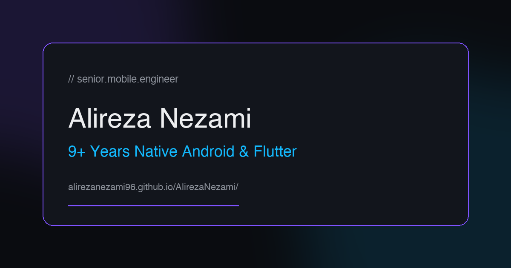

# Alireza Nezami — Portfolio

> Senior Mobile Engineer · 9+ years native Android · Flutter · Kotlin · Java

**Live site:** https://alirezanezami96.github.io/AlirezaNezami/

## About

This is my personal portfolio site. It showcases production apps I've shipped across healthcare, logistics, HR, travel, fitness, food delivery, and event-ticketing verticals — as well as an open-source AI job scraper.

Key features:
- 8 highlighted projects (7 mobile apps + 1 open-source Python/AI tool)
- Neon Dodge mini-game with global leaderboard (Supabase-backed)
- 11-language support (EN, FA, AR, ES, FR, ZH, HI, BN, RU, PT, UR) with full RTL layout
- Firebase Analytics with heatmaps & engagement events
- Glassmorphism design with GSAP animations and Three.js canvas

## Tech

HTML · CSS · Vanilla JS · GSAP · Three.js · Supabase · Firebase

## Projects Featured

| # | Project | Stack |
|---|---------|-------|
| 1 | Albert Health | Flutter, Riverpod, Firebase, HealthKit |
| 2 | Yolda Carrier | Kotlin, Jetpack Compose, MVVM |
| 3 | Biletino | Kotlin, Flutter, Room, Payment SDK |
| 4 | Kolay HR | Kotlin, Hilt, Coroutines, WorkManager |
| 5 | ABC Trainerize | Kotlin, Java, Android SDK |
| 6 | Fuudy | Kotlin, Coroutines, Google Maps SDK |
| 7 | WegoPro | Kotlin, Jetpack, Android SDK |
| 8 | Visa Sponsorship Daily Jobs | Python, Playwright, LLM Filtering, GitHub Actions |

## Screenshot

